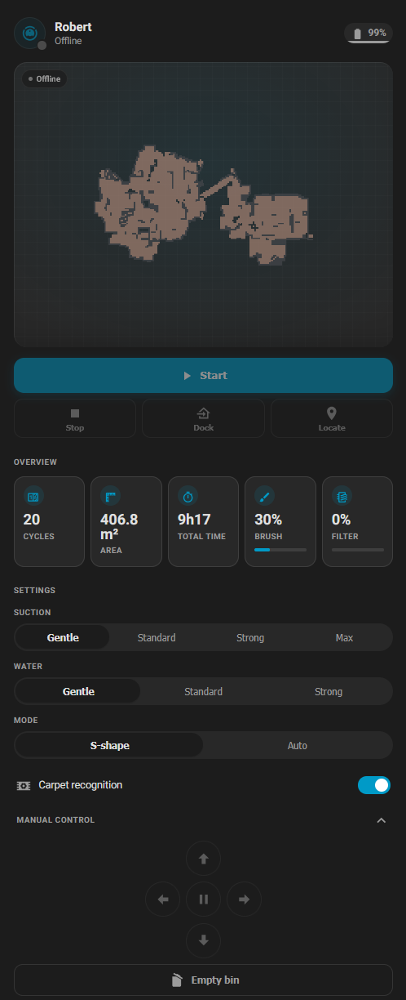
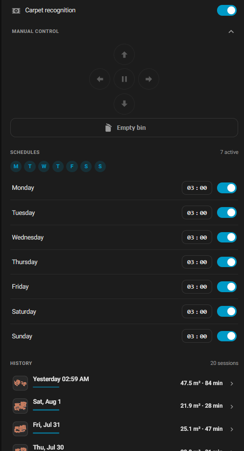

# ILIFE Vacuum for Home Assistant

[](https://github.com/hacs/integration)
[](https://github.com/maximedeprince/ha-ilife/releases)
[](LICENSE)

Custom Home Assistant integration for ILIFE robot vacuums.

- **ILIFEHOME** app (Alibaba IoT / 3irobotix cloud) — talks to the cloud API
  directly, no Tuya, no MQTT broker to set up. Tested with the **ILIFE V3x**.
- **ILIFE Clean** app (Tuya cloud) — used by newer models. The T20s pairs
  via a `SmartLife-XXXX` Wi-Fi hotspot and the app itself documents linking
  through the Smart Life/Tuya ecosystem. Tested with the **ILIFE T20s**.

<p align="center">
  
  &nbsp;&nbsp;
  
</p>

> Tested with the **ILIFE V3x** on the **ILIFEHOME** app, **EU** region.
> Other 3irobotix‑based ILIFE models likely work — **testers welcome** (see below).

## Whitelabels (multi-brand)

ILIFE ships several rebranded apps on the **same** Alibaba Living Link platform (same
login handshake, endpoints and device logic) — they differ only in a small tenant
profile. The integration supports these via **brand profiles** (`brands.py`), chosen
in the config flow:

| Brand | App / package | IoT appKey | Default region |
|-------|---------------|-----------|----------------|
| `ilife` | ILIFE (`com.ilife.home.global`) | 29416808 | eu |
| `ava`   | AVA PRO MAX (`com.robot.ava`)   | 33417005 | us |

Adding a brand = one entry in `brands.py` (its API-Gateway appKey/appSecret, OpenAccount
appID/appVersion and default region) + it appears in the setup dropdown automatically.
The AVA profile was validated end-to-end against the live us-east-1 cloud.

## Features — ILIFEHOME backend

- 🧹 Full vacuum entity: start / pause / stop / return to dock / locate
- 🌀 Suction (Gentle → Max) and 💧 water level, 🧭 cleaning mode (S‑shape / Auto)
- 🟫 Carpet‑recognition switch, 🎮 directional remote buttons, 🗑️ empty bin
- 📅 Per‑day schedules (enable + time)
- 🔋 Battery, brushes and filter wear, last clean, connectivity (online/offline)
- 🗺️ Live map camera + **clickable cleaning history with the day's map**
- 🖼️ Each cleaning is archived as a tiny PNG in `www/ilife_maps/`
- 🧩 Bundled **ILIFE Vacuum Card** — added from the UI, **responsive** (2 columns on desktop, 1 on mobile), English + French
- 👥 Multiple vacuums and multiple accounts supported
- 🧾 **Download diagnostics** (credentials redacted) and 🗑️ **remove old / replaced devices** from the UI

## Features — ILIFE Clean backend

- 🧹 Full vacuum entity: start / pause / stop / return to dock / locate
- 🔋 Battery, current cleaning area/time, fault status, connectivity (online/offline)
- 🧭 Cleaning mode select, if supported by the device
- 🔀 Suction, water level, mop/self-empty toggles, consumables, and other metrics.

## Installation (HACS)

1. HACS → search **ILIFE Vacuum** → **Download** (or add this repo as a custom repository, type *Integration*).
2. Restart Home Assistant.
3. **Settings → Devices & Services → Add Integration → ILIFE Vacuum**.
4. Choose **ILIFEHOME** or **ILIFE Clean** and follow that backend's form.

## The card — add it from the UI

Edit a dashboard → **Add card** → search **ILIFE Vacuum Card** → pick your vacuum
in the visual editor. Everything else (map, sensors, schedules…) is detected
automatically. No YAML needed.

The card is registered automatically for storage‑mode dashboards. For
**YAML‑mode** dashboards, add the resource manually:

```yaml
- url: /ilife_cards/ilife-vacuum-card.js
  type: module
```

## ILIFE Clean setup

ILIFE Clean vacuums run on Tuya's white-label IoT cloud. Tuya only allows
password login from its own first-party apps (Tuya Smart / Smart Life) — an
OEM app account like ILIFE Clean's can't be logged into directly. Instead you
authorize your ILIFE Clean account into your **own free Tuya Cloud Project**,
the same one-time step used by other Tuya-based integrations (e.g.
`tuya-local`/`localtuya`) for OEM apps:

1. Create a free account at [iot.tuya.com](https://iot.tuya.com) and go to
   **Cloud → Development → Create Cloud Project**. Development method:
   **Smart Home**. Pick the data center matching your account's region — all
   six Tuya data centers are supported (Central Europe, Western Europe,
   Western America, Eastern America, China, India). **Note the one you
   picked**: a Cloud Project is only reachable on its own data center, and
   choosing the wrong one here is the most common cause of setup failing.
   Several countries (France among them) can be on *either* European data
   center, so if Central Europe fails, try Western Europe.
2. Subscribe the project to the **IoT Core** / **Authorization** / **Smart
   Home Basic Service** API groups (Tuya prompts for this during project
   creation, free tier).
3. On the project's **Overview** tab, copy the **Access ID (Client ID)** and
   **Access Secret (Client Secret)**.
4. **Move the vacuum to the Tuya Smart app.** The ILIFE Clean app has no
   account-authorization scanner — only the device-pairing one on its splash
   screen, which rejects the linking QR code ("QR code expired"). So install
   [**Tuya Smart**](https://play.google.com/store/apps/details?id=com.tuya.smart)
   (or **Smart Life**), sign in with a Tuya account in the same region as your
   Cloud Project, **remove the vacuum from ILIFE Clean** (a Tuya device belongs
   to one account at a time) and add it in Tuya Smart instead.

   If pairing stalls at *"connecting to router"*, see
   [Pairing the vacuum in Tuya Smart](#pairing-the-vacuum-in-tuya-smart) below —
   that step trips up most people and the fix is on the Wi-Fi side.
5. Go to the project's **Devices** tab → **Link App Account** → **Add App
   Account**, and scan the QR code **from inside Tuya Smart** (home screen ⊕ →
   **Scan**, or **Me →** scan icon). Once linked, copy the **UID** shown in
   that list.
6. In Home Assistant: **Settings → Devices & Services → Add Integration →
   ILIFE Vacuum → ILIFE Clean**, and enter the Access ID, Access Secret, UID
   and data center from steps 3–5.

> **If setup fails**, the integration now logs the exact reason Tuya gave.
> Check **Settings → System → Logs** for a `custom_components.ilife` line — it
> names the error code and what to fix. Three causes cover most failures:
>
> - a **data center mismatch** between the Cloud Project and the one selected
>   in Home Assistant;
> - an **out-of-sync host clock** (error `1013`, *"request time is invalid"*) —
>   Tuya signs every request with the current time and allows only a few
>   minutes of drift, so the log line tells you exactly how far off your Home
>   Assistant host is and you fix it with NTP on the host;
> - an **expired Tuya trial** (error `28841002`, *"your subscription to cloud
>   development plan has expired"*). Tuya's Trial Edition is free but
>   time-limited. Renewing costs nothing: on iot.tuya.com go to **Cloud → Cloud
>   Services → IoT Core**, renew the trial, then re-authorize it for your
>   project under its **Service API** tab. Expect to repeat this whenever the
>   trial period lapses — it is a Tuya platform policy, nothing to do with this
>   integration.

> **Already using the official Tuya integration?** That's fine — the two can
> share the same devices. A Tuya account can be linked to several Cloud
> Projects, and each integration talks to its own. You will simply see the
> vacuum twice in Home Assistant; disable whichever set of entities you don't
> want.

### Pairing the vacuum in Tuya Smart

Step 4 is where most setups get stuck, and the failure always looks the same:
the app sits on *"connecting to router"* until it times out. That message means
the robot never joined your Wi-Fi at all — so the fix is on the Wi-Fi side, not
in Home Assistant.

**Read the LED first.** It tells you which pairing mode the robot is actually
in:

| LED | Mode | How it works |
| --- | --- | --- |
| fast blink, ~2×/second | **EZ / SmartConfig** | the phone broadcasts your Wi-Fi credentials over UDP and hopes the robot hears them — silently defeated by mesh backhaul, AP isolation or multicast filtering |
| slow blink, ~1 every 2–3 s | **AP / hotspot** | the robot raises a `SmartLife-XXXX` hotspot, your phone joins it and hands the credentials over directly — no broadcast, far more reliable |

**Selecting "AP mode" in Tuya Smart does not switch the robot.** You have to put
the robot into it yourself: reset it once (LED blinks fast), then hold the same
button again until the blink visibly *slows down*. Only then, in Tuya Smart, use
**Add device →** pick the robot vacuum manually **→ "Other mode" / AP Mode**,
and join `SmartLife-XXXX` from your phone's Wi-Fi settings when prompted.

On Android, also **turn mobile data off** while pairing in AP mode — the robot's
hotspot has no internet and the phone will quietly switch away from it — and
grant Tuya Smart the **Location** and **Nearby devices** permissions.

**If AP mode stalls too, the router is refusing the robot.** Tuya Wi-Fi modules
are picky in ways that stay invisible unless you go looking:

- **WPA3, or WPA2/WPA3 mixed mode** — they only speak WPA/WPA2-PSK. Set the
  2.4 GHz SSID to **WPA2-PSK (AES)** for pairing. Likewise **PMF / 802.11w**
  must be *optional* or *disabled*, never *required*.
- **Channel** — pin the 2.4 GHz channel to **1, 6 or 11**. Tuya modules
  frequently ignore channels 12–13, which European routers pick on "auto".
- **2.4 GHz only** — split the bands if your router merges them under one SSID,
  and keep the phone on that same network.
- **AP/client isolation off**, and pair against the main SSID, not a guest
  network.
- **Plain ASCII SSID and password**, no spaces or special characters, and the
  SSID not hidden.

**One diagnostic worth doing:** watch your router's DHCP client list during a
pairing attempt. If the robot appears there even briefly, it *did* associate and
the problem is on the way out to Tuya's cloud (DNS filtering, IoT VLAN,
firewall) — a different fix entirely. If it never appears, it never associated,
and the list above is where to look.

## 🙏 Help wanted — testers for other ILIFE models

The code is written to be generic, so other 3irobotix‑based ILIFE vacuums have a
good chance of working. If you own a **different model**, please try it and
[open an issue](https://github.com/maximedeprince/ha-ilife/issues/new/choose)
with your model, **debug logs** and the **diagnostics file** (see below) — that's
what lets me add support. For a **blank or wrong map**, the diagnostics file is
the key: it contains the raw map fields your model actually reports.

## Troubleshooting — debug logs

Add this to `configuration.yaml`, restart, reproduce the issue, then copy the
`custom_components.ilife` lines from **Settings → System → Logs**:

```yaml
logger:
  default: info
  logs:
    custom_components.ilife: debug
```

### Diagnostics file

For map or model‑specific problems, the fastest way to help is the diagnostics
file. Go to **Settings → Devices & Services → ILIFE Vacuum → ⋮ → Download
diagnostics** (there is also a per‑device button). It contains the raw property
payload each vacuum reports — including the map data — with your email, password
and device IDs **redacted**. Attach it to the issue.

### Removing an old device

Replaced or sold a vacuum? Once it is gone from your ILIFE account, open the
device page → **⋮ → Delete**. Devices that are still on the account cannot be
removed this way (they would just come back on the next refresh).

## Notes

- Credentials are stored by Home Assistant in the config entry; they are never
  written to logs. ILIFEHOME's shared API keys are baked in (identical for
  all ILIFE users) — no personal secret is included in this repository..
- This is an unofficial integration, not affiliated with ILIFE, 3irobotix or Tuya.

## License

MIT — see [LICENSE](LICENSE).
